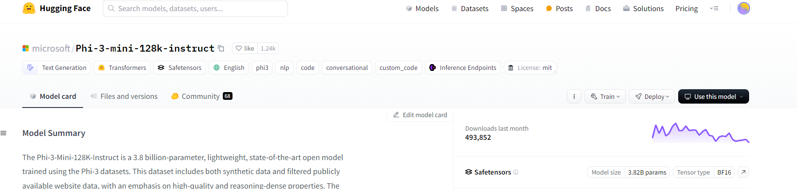

# hf_data_generation
This repo contains a simple Jupyter notebook-based machine-learning instruction datasets generation script using open-sourced Hugging Face models and a Hugging Face pro subscription (required).

### Installation
```pip install -r requirements.txt```

### Configuration
1. Setup your huggingface account.
2. Subscribe to huggingface pro and get the api key.
3. Edit the `config.ini` file and add your api key.
4. To use a different model, edit the `config.ini` file and change the model name. You can get the endpoint from the hugging face model hub by clicking on "Deploy model" and copying the "Inference Endpoint (Serverless)" URL.



### Usage
1. Run the `notebooks/hf_data_generation.ipynb` notebook.
2. Your data must contain a column named `input` which contains the prompt data.
3. Start generating data by running the cells in notebook. The generation process is parallel but may take some time depending on data size, jobs count and timeout.
4. Enjoy! 
5. Please, give a star if you like it. Thanks !